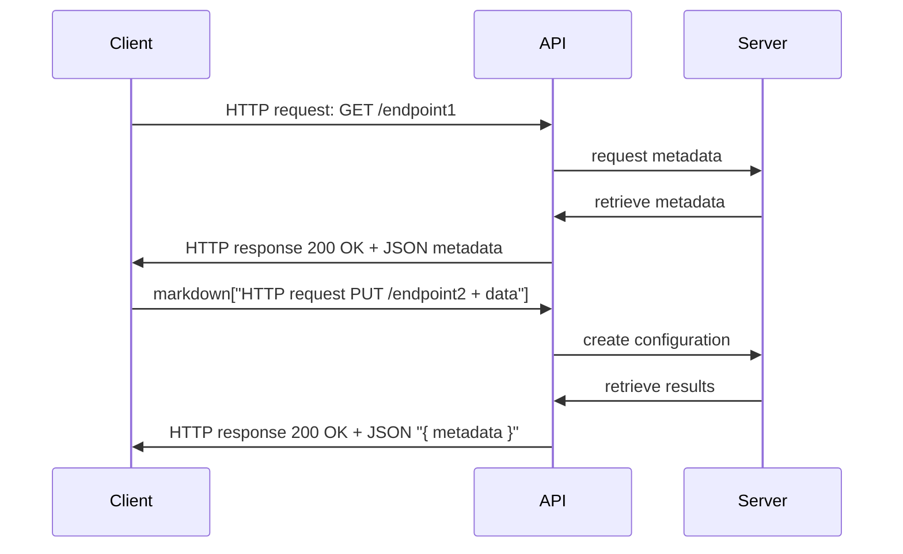
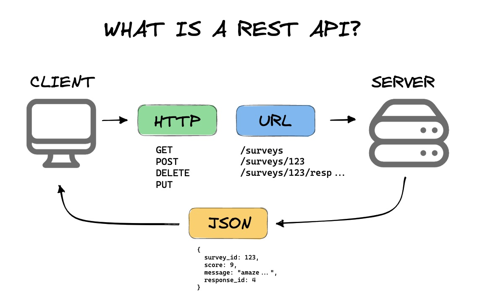
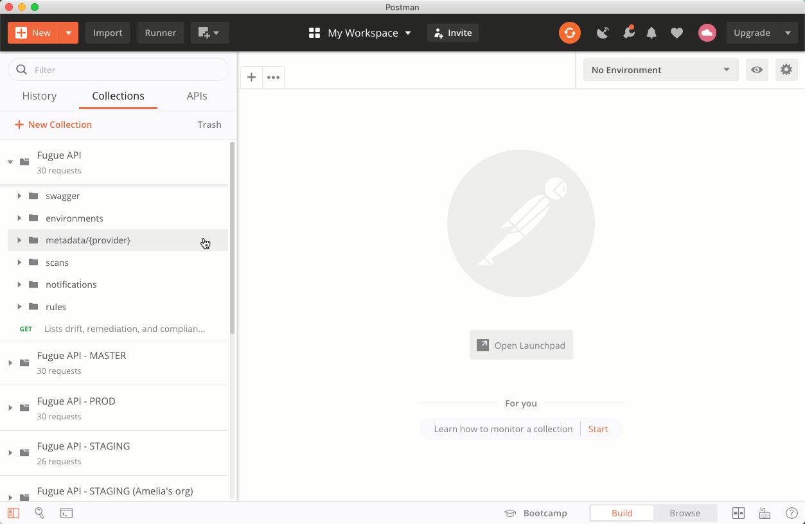

# REST API

## Introduction

REST (Representational State Transfer) is an architectural style used to design networked applications, specifically web services. RESTful APIs (Application Programming Interfaces) are a set of guidelines and principles that adhere to the REST architectural style. They enable communication and interaction between various software systems over the internet.




For example:

- `GET /users`: Retrieve a list of users.
- `GET /users/{id}`: Retrieve a specific user by ID.
- `POST /users`: Create a new user.
- `PUT /users/{id}`: Update an existing user by ID.
- `DELETE /users/{id}`: Delete a user by ID.

## Key Concepts

- **Resources**: In REST, everything is considered a resource, which can be a data object, a service, or any other type of information. Each resource is uniquely identified by a URL (Uniform Resource Locator), also called an *endpoint*.  

- **HTTP Methods**: REST APIs utilize standard `HTTP` methods to perform operations on resources. The most commonly used methods are:
    - `GET`: Used to retrieve data from the server.
    - `POST`: Used to create new resources on the server.
    - `PUT`: Used to update existing resources on the server.
    - `DELETE`: Used to remove resources from the server.  

- **Uniform Interface**: REST APIs have a uniform and consistent interface, which means that the same set of methods and conventions apply to all resources. This simplicity makes it easier to understand and use the APIs.  

- **Stateless**: RESTful APIs are stateless, meaning each request from a client to a server must contain all the information needed to understand and process the request. The server doesn't store any session information about the client.  

- **Representation**: Resources can have multiple representations such as JSON, XML, HTML, or plain text. Clients can specify the representation they prefer by setting the appropriate HTTP headers.

- **Scalability**: REST APIs are highly scalable due to their stateless nature and separation of concerns between client and server.  

- **Flexibility**: Multiple data formats (JSON, XML, etc.) can be used to represent resources, making it easy for clients with different requirements to interact with the API.

- **Platform Independence**: REST APIs can be accessed and used by clients on any platform or device that supports HTTP.
  
- **Caching**: Caching can be easily implemented to improve the API's performance and reduce the load on the server.
  
- **Security**: REST APIs can use standard HTTP security mechanisms such as SSL/TLS encryption for secure communication.


<!-- 
<p align="center">
  
</p>
<br/>

3 main components: 
1. URL endpoint
2. HTTP verb or API operations
3. Body -->

<!-- API operations
- GET
- POST
- PUT
- PATCH
- DELETE -->
  
  
## API Tools  

### cURL  

Use [cURL](https://curl.se) to quickly test an API endpoint

Getting some metadata (read or `GET` operation)
```console
curl <URL>
```

For example:
```console
curl https://catfact.ninja/fact
{"fact":"Neutering a cat extends its life span by two or three years.","length":60}
```


Creating a resource (create or `POST` operation)
```console
curl -X POST <URL>
     -d "request data in JSON"
```

For example:
```console
curl -X POST https://reqbin.com/echo/post/json \
   -H 'Content-Type: application/json' \
   -d '{"login":"my_login","password":"my_password"}'

{
    "success": "true"
}
```

Output in [JSON](https://www.w3schools.com/js/js_json_intro.asp)


### POSTMan  
https://www.postman.com

<p align="center">
  
</p>
<br/>

## Google Maps API

Here's an example of Google Maps API


```console
curl -L -X GET 'https://maps.googleapis.com/maps/api/place/findplacefromtext/json?input=Museum%20of%20Contemporary%20Art%20Australia&inputtype=textquery&fields=formatted_address%2Cname%2Crating%2Copening_hours%2Cgeometry&key=<YOUR_GOOGLE_MAPS_API_KEY_GOES_HERE>'
{
   "candidates" : [
      {
         "formatted_address" : "140 George St, The Rocks NSW 2000, Australie",
         "geometry" : {
            "location" : {
               "lat" : -33.8599358,
               "lng" : 151.2090295
            },
            "viewport" : {
               "northeast" : {
                  "lat" : -33.85824377010728,
                  "lng" : 151.2104386798927
               },
               "southwest" : {
                  "lat" : -33.86094342989272,
                  "lng" : 151.2077390201073
               }
            }
         },
         "name" : "Museum of Contemporary Art Australia",
         "opening_hours" : {
            "open_now" : false
         },
         "rating" : 4.4
      }
   ],
   "status" : "OK"
}
```

Sample Python script to 
```python
import googlemaps
from datetime import datetime
import os
import json

MY_API_KEY = os.environ["GMAPS_KEY"]

gmaps = googlemaps.Client(key=MY_API_KEY)

# Geocoding an address
geocode_result = gmaps.geocode('1600 Amphitheatre Parkway, Mountain View, CA')
print(geocode_result)

# Look up an address with reverse geocoding
reverse_geocode_result = gmaps.reverse_geocode((40.714224, -73.961452))
print(reverse_geocode_result)

# Request directions via public transit
now = datetime.now()
directions_result = gmaps.directions("Sydney Town Hall",
                                     "Parramatta, NSW",
                                     mode="transit",
                                     departure_time=now)
print(directions_result)

# Validate an address with address validation
addressvalidation_result =  gmaps.addressvalidation(['1600 Amphitheatre Pk'], 
                                                    regionCode='US',
                                                    locality='Mountain View', 
                                                    enableUspsCass=True)
print(addressvalidation_result)
```


## Additional Resources

[Amazon API Gateway Documentation](https://docs.aws.amazon.com/apigateway/)  

[Azure REST API reference](https://learn.microsoft.com/en-us/rest/api/azure/)  

[Google APIs Explorer](https://developers.google.com/apis-explorer)

[Online REST & SOAP API Testing Tool](https://reqbin.com)

