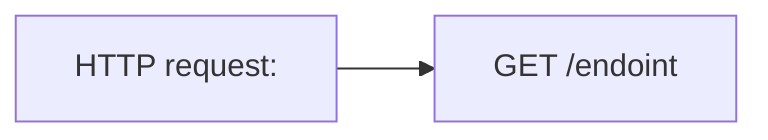
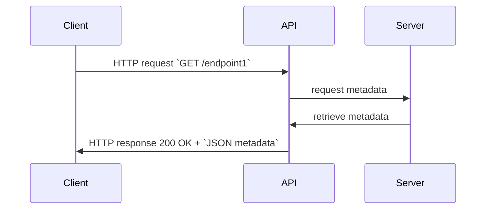
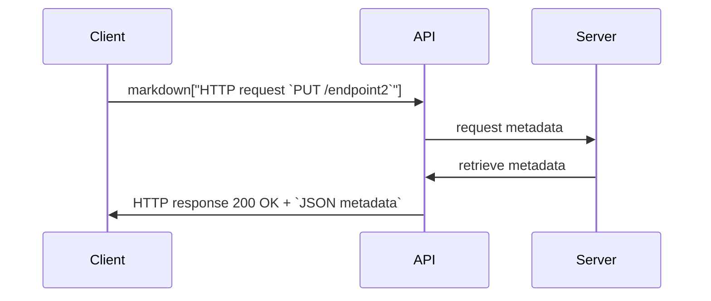

# REST API

## Introduction

REST (Representational State Transfer) is an architectural style used to design networked applications, specifically web services. RESTful APIs (Application Programming Interfaces) are a set of guidelines and principles that adhere to the REST architectural style. They enable communication and interaction between various software systems over the internet.




```mermaid
%%{init: {"flowchart": {"htmlLabels": false}} }%%
flowchart LR
    markdown["Client"]
    newLines["HTTP request:
    `GET /endoint`"]
    markdown["API"]
    markdown["Server"]
    markdown --> newLines
    newLines za````markdown --> 
```


```mermaid
flowchart LR
    Client---|HTTP request: `GET /endoint` |API
    API---|Server
    Server---|API
    API---|HTTP response `JSON metadata`|Client
``````

```mermaid
graph LR
    A[Client] -- API: HTTP request `GET /endpoint/` --> B[API] 
    B[API] -- request metadata --> C[Server]
    C[Server] -- retrieve metadata --> B[API]
    B[API] -- HTTP response `JSON metadata` --> A[Client]
```






## Key Concepts

- **Resources*: In REST, everything is considered a resource, which can be a data object, a service, or any other type of information. Each resource is uniquely identified by a URL (Uniform Resource Locator).  

- **HTTP Methods**: REST APIs utilize standard HTTP methods to perform operations on resources. The most commonly used methods are:
    - GET: Used to retrieve data from the server.
    - POST: Used to create new resources on the server.
    - PUT: Used to update existing resources on the server.
    - DELETE: Used to remove resources from the server.  

- **Uniform Interface**: REST APIs have a uniform and consistent interface, which means that the same set of methods and conventions apply to all resources. This simplicity makes it easier to understand and use the APIs.  

- **Stateless**: RESTful APIs are stateless, meaning each request from a client to a server must contain all the information needed to understand and process the request. The server doesn't store any session information about the client.  

- **Representation**: Resources can have multiple representations such as JSON, XML, HTML, or plain text. Clients can specify the representation they prefer by setting the appropriate HTTP headers.
Hypermedia as the Engine of Application State (HATEOAS): This principle suggests that the API responses should contain links to related resources. Clients use these links to navigate the API and discover available actions dynamically.
Advantages of REST APIs.  

- **Scalability**: REST APIs are highly scalable due to their stateless nature and separation of concerns between client and server.  

- **Flexibility**: Multiple data formats (JSON, XML, etc.) can be used to represent resources, making it easy for clients with different requirements to interact with the API.

- **Platform Independence**: REST APIs can be accessed and used by clients on any platform or device that supports HTTP.
Caching: Caching can be easily implemented to improve the API's performance and reduce the load on the server.
Security: REST APIs can use standard HTTP security mechanisms such as SSL/TLS encryption for secure communication.
Conclusion

REST APIs have become the standard for building web services due to their simplicity, scalability, and ease of integration. Following the principles of REST ensures that APIs are well-structured, easily maintainable, and can be efficiently used by various client applications.

<p align="center">
  
</p>
<br/>

3 main components: 
1. URL endpoint
2. HTTP verb or API operations
3. Body

API operations
- GET
- POST
- PUT
- PATCH
- DELETE

## API Tools  

### cURL  

```console
curl https://catfact.ninja/fact

{"fact":"Neutering a cat extends its life span by two or three years.","length":60}

curl -X PUT <URL>
     -d "PUT request data"
```

```console
curl -X POST https://reqbin.com/echo/post/json \
   -H 'Content-Type: application/json' \
   -d '{"login":"my_login","password":"my_password"}'

{
    "success": "true"
}
```

Output in [JSON](https://www.w3schools.com/js/js_json_intro.asp)


### POSTMan  


## Google Maps API

```console
curl -L -X GET 'https://maps.googleapis.com/maps/api/place/findplacefromtext/json?input=Museum%20of%20Contemporary%20Art%20Australia&inputtype=textquery&fields=formatted_address%2Cname%2Crating%2Copening_hours%2Cgeometry&key=$GCP_KEY_ID'
```


```python
import requests

YOUR_API_KEY = os.environ["GCP_KEY_ID"]

url = "https://maps.googleapis.com/maps/api/place/findplacefromtext/json?input=Museum%20of%20Contemporary%20Art%20Australia&inputtype=textquery&fields=formatted_address%2Cname%2Crating%2Copening_hours%2Cgeometry&key=YOUR_API_KEY"

payload = {}
headers = {}

response = requests.request("GET", url, headers=headers, data=payload)

print(response.text)
```


## Resources

[Amazon API Gateway Documentation](https://docs.aws.amazon.com/apigateway/)  

[Azure REST API reference](https://learn.microsoft.com/en-us/rest/api/azure/)  

[Google APIs Explorer](https://developers.google.com/apis-explorer)

[Online REST & SOAP API Testing Tool](https://reqbin.com)